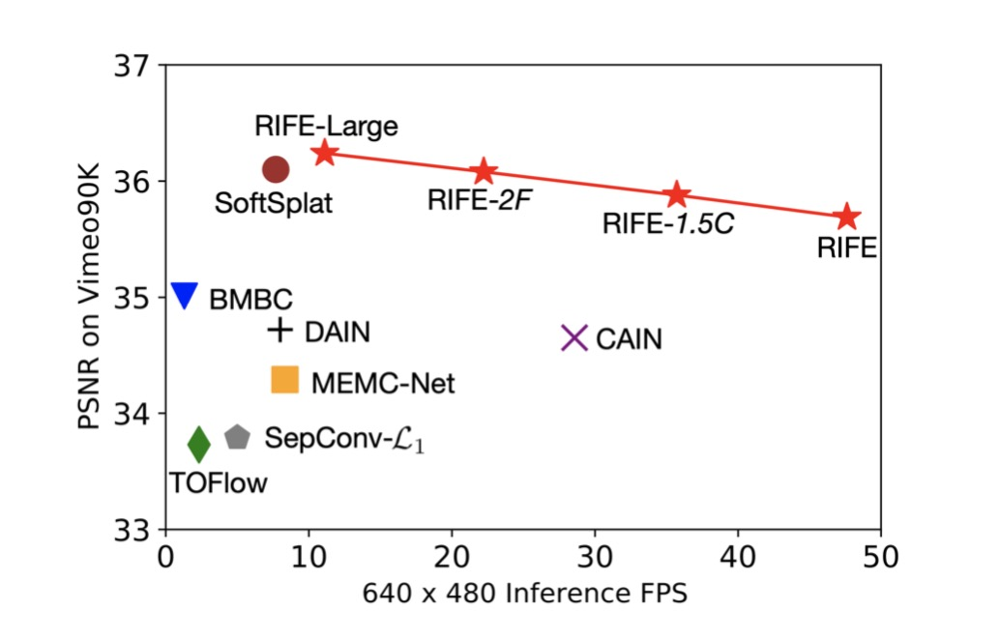

# RIFE Video Frame Interpolation v1.6
## [arXiv](https://arxiv.org/abs/2011.06294) | [Project Page](https://rife-vfi.github.io) | [Reddit](https://www.reddit.com/r/linux/comments/jy4jjl/opensourced_realtime_video_frame_interpolation/) | [YouTube](https://www.youtube.com/watch?v=60DX2T3zyVo&feature=youtu.be) | [Bilibili](https://www.bilibili.com/video/BV1K541157te?from=search&seid=5131698847373645765)

**12.13 News: We have updated the v1.6 model and support UHD mode.**

**12.5 News: We have optimized the inference code and got 20% speedup!**

**12.3 News: We have updated the v1.5 model optimized for 1080p video. The performance improvement is incredible! Please check our [update log](https://github.com/hzwer/arXiv2020-RIFE/issues/41#issuecomment-737651979).**

**11.22 News: We notice a new windows app is trying to integrate RIFE, we hope everyone to try and help them improve. You can download [Flowframes](https://nmkd.itch.io/flowframes) for free.**

**There is [a tutorial of RIFE](https://www.youtube.com/watch?v=gf_on-dbwyU&feature=emb_title) on Youtube.**

**You can easily use [colaboratory](https://colab.research.google.com/github/hzwer/arXiv2020-RIFE/blob/main/Colab_demo.ipynb) to have a try and generate the [our youtube demo](https://www.youtube.com/watch?v=LE2Dzl0oMHI).**

Our model can run 30+FPS for 2X 720p interpolation on a 2080Ti GPU. Currently, our method supports 2X,4X,8X... interpolation for 1080p video, and multi-frame interpolation between a pair of images. Everyone is welcome to use our alpha version and make suggestions!

16X interpolation results from two input images: 


## Usage

### Installation

```
git clone git@github.com:hzwer/arXiv2020-RIFE.git
cd arXiv2020-RIFE
pip3 install -r requirements.txt
```

* Download the pretrained **HD** models from [here](https://drive.google.com/file/d/11l8zknO1V5hapv2-Ke4DG9mHyBomS0Fc/view?usp=sharing).
We are optimizing the visual effects and will support animation in the future. (百度网盘链接:https://pan.baidu.com/s/1Sc4o50NPlXQ5a1fdfffkgw  密码:1fne，把压缩包解开后放在 train_log/\*.pkl)

* Unzip and move the pretrained parameters to train_log/\*.pkl

### Run

**Video Frame Interpolation**

You can use our [demo video](https://drive.google.com/file/d/1i3xlKb7ax7Y70khcTcuePi6E7crO_dFc/view?usp=sharing) or your own video. 
```
python3 inference_video.py --exp=1 --video=video.mp4 
```
(generate video_2X_xxfps.mp4)
```
python3 inference_video.py --exp=2 --video=video.mp4
```
(for 4X interpolation)
```
python3 inference_video.py --exp=1 --video=video.mp4 --UHD
```
(If your video has very high resolution such as 2K and 4K, we recommend to use UHD mode.)
```
python3 inference_video.py --exp=2 --img=input/
```
(to read video from pngs, like input/0.png ... input/612.png, ensure that the png names are numbers)
```
python3 inference_video.py --exp=2 --video=video.mp4 --fps=60
```
(add slomo effect, the audio will be removed)
```
python3 inference_video.py --video=video.mp4 --montage --png
```
(if you want to montage the origin video, skip static frames and save the png format output)

The warning info, 'Warning: Your video has *** static frames, it may change the duration of the generated video.' means that your video has changed the frame rate by adding static frames, it is common if you have processed 25FPS video to 30FPS.

**Image Interpolation**

```
python3 inference_img.py --img img0.png img1.png --exp=4
```
(2^4=16X interpolation results)
After that, you can use pngs to generate mp4:
```
ffmpeg -r 10 -f image2 -i output/img%d.png -s 448x256 -c:v libx264 -pix_fmt yuv420p output/slomo.mp4 -q:v 0 -q:a 0
```
You can also use pngs to generate gif:
```
ffmpeg -r 10 -f image2 -i output/img%d.png -s 448x256 -vf "split[s0][s1];[s0]palettegen=stats_mode=single[p];[s1][p]paletteuse=new=1" output/slomo.gif
```

## Evaluation
Download [RIFE model reported by our paper](https://drive.google.com/file/d/1c1R7iF-ypN6USo-D2YH_ORtaH3tukSlo/view?usp=sharing).

**Vimeo90K**: Download [Vimeo90K dataset](http://toflow.csail.mit.edu/) at ./vimeo_interp_test

**MiddleBury**: Download [MiddleBury OTHER dataset](https://vision.middlebury.edu/flow/data/) at ./other-data and ./other-gt-interp
```
python3 benchmark/Vimeo90K.py
# (Final result: "Avg PSNR: 35.695 SSIM: 0.9788")
python3 benchmark/MiddelBury_Other.py
# (Final result: "2.058")
```

## Training and Reproduction
Because Vimeo90K dataset and the corresponding optical flow labels are too large, we cannot provide a complete dataset download link. We provide you with [a subset containing 100 samples](https://drive.google.com/file/d/1_MQmFWqaptBuEbsV2tmbqFsxmxMIqYDU/view?usp=sharing) for testing the pipeline. Please unzip it at ./dataset

Each sample includes images (I0 I1 Imid : 9 x 256 x 448), and optical flow (flow_t0, flow_t1: 4, 256, 448). 

For origin images, you can download them from [Vimeo90K dataset](http://toflow.csail.mit.edu/).

For generating optical flow labels, our paper use [pytorch-liteflownet](https://github.com/sniklaus/pytorch-liteflownet). We also recommend [RAFT](https://github.com/princeton-vl/RAFT) because it's easier to configure. We recommend generating optical flow labels on 2X size images for better labels. You can also generate labels during training, or finetune the optical flow network on the training set. The final impact of the above operations on Vimeo90K PSNR is expected to be within 0.3.

We use 16 CPUs, 4 GPUs and 20G memory for training: 
```
python3 -m torch.distributed.launch --nproc_per_node=4 train.py --world_size=4
```

## Citation

```
@article{huang2020rife,
  title={RIFE: Real-Time Intermediate Flow Estimation for Video Frame Interpolation},
  author={Huang, Zhewei and Zhang, Tianyuan and Heng, Wen and Shi, Boxin and Zhou, Shuchang},
  journal={arXiv preprint arXiv:2011.06294},
  year={2020}
}
```

## Reference


Optical Flow:
[ARFlow](https://github.com/lliuz/ARFlow)  [pytorch-liteflownet](https://github.com/sniklaus/pytorch-liteflownet)  [RAFT](https://github.com/princeton-vl/RAFT)  [pytorch-PWCNet](https://github.com/sniklaus/pytorch-pwc)

Video Interpolation: 
[DAIN](https://github.com/baowenbo/DAIN)  [CAIN](https://github.com/myungsub/CAIN)  [TOflow](https://github.com/HyeongminLEE/AdaCoF-pytorch)  [MEMC-Net](https://github.com/baowenbo/MEMC-Net)   [SoftSplat](https://github.com/sniklaus/softmax-splatting)   [SepConv](https://github.com/sniklaus/sepconv-slomo)   [BMBC](https://github.com/JunHeum/BMBC)
