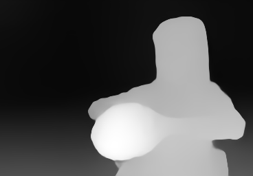

# Real-Time Intermediate Flow Estimation for Video Frame Interpolation
## Introduction
This project is the implement of [Real-Time Intermediate Flow Estimation for Video Frame Interpolation](https://arxiv.org/abs/2011.06294). Currently, our model can run 30+FPS for 2X 720p interpolation on a 2080Ti GPU. It supports arbitrary-timestep interpolation between a pair of images. 

**2022.7.4 - Our paper is accepted by ECCV2022 🎉. Thanks to all relevant authors, contributors and users!**

From 2020 to 2022, we submitted RIFE for five submissions（rejected by CVPR21 ICCV21 AAAI22 CVPR22). Thanks to all anonymous reviewers, your suggestions have helped to significantly improve the paper! 

[ECCV Poster](https://drive.google.com/file/d/1xCXuLUCSwhN61kvIF8jxDvQiUGtLK0kN/view?usp=sharing) | [ECCV 5-min presentation](https://youtu.be/qdp-NYqWQpA) | [论文中文介绍](https://zhuanlan.zhihu.com/p/568553080)

## [YouTube](https://www.youtube.com/results?search_query=rife+interpolation&sp=CAM%253D) | [BiliBili](https://search.bilibili.com/all?keyword=SVFI&order=stow&duration=0&tids_1=0) | [Colab](https://colab.research.google.com/github/hzwer/ECCV2022-RIFE/blob/main/Colab_demo.ipynb) | [Tutorial](https://www.youtube.com/watch?v=gf_on-dbwyU&feature=emb_title)

**Pinned Software: [RIFE-App](https://grisk.itch.io/rife-app) | [FlowFrames](https://nmkd.itch.io/flowframes) | [SVFI (中文)](https://github.com/YiWeiHuang-stack/Squirrel-Video-Frame-Interpolation)**

16X interpolation results from two input images: 




## Software
[Flowframes](https://nmkd.itch.io/flowframes) | [SVFI(中文)](https://github.com/YiWeiHuang-stack/Squirrel-Video-Frame-Interpolation) | [Waifu2x-Extension-GUI](https://github.com/AaronFeng753/Waifu2x-Extension-GUI) | [Autodesk Flame](https://vimeo.com/505942142) | [SVP](https://www.svp-team.com/wiki/RIFE_AI_interpolation) | [MPV_lazy](https://github.com/hooke007/MPV_lazy) | [enhancr](https://github.com/mafiosnik777/enhancr)

[RIFE-App(Paid)](https://grisk.itch.io/rife-app) | [Steam-VFI(Paid)](https://store.steampowered.com/app/1692080/SVFI/) 

We are not responsible for and participating in the development of above software. According to the open source license, we respect the commercial behavior of other developers.

[VapourSynth-RIFE](https://github.com/HolyWu/vs-rife) | [RIFE-ncnn-vulkan](https://github.com/nihui/rife-ncnn-vulkan) | [VapourSynth-RIFE-ncnn-Vulkan](https://github.com/HomeOfVapourSynthEvolution/VapourSynth-RIFE-ncnn-Vulkan) 


If you are a developer, welcome to follow [Practical-RIFE](https://github.com/hzwer/Practical-RIFE), which aims to make RIFE more practical for users by adding various features and design new models with faster speed.
## CLI Usage

### Installation

```
git clone git@github.com:megvii-research/ECCV2022-RIFE.git
cd ECCV2022-RIFE
pip3 install -r requirements.txt
```

* Download the pretrained **HD** models from [here](https://drive.google.com/file/d/1APIzVeI-4ZZCEuIRE1m6WYfSCaOsi_7_/view?usp=sharing). (百度网盘链接:https://pan.baidu.com/share/init?surl=u6Q7-i4Hu4Vx9_5BJibPPA 密码:hfk3，把压缩包解开后放在 train_log/\*)

* Unzip and move the pretrained parameters to train_log/\*

* This model is not reported by our paper, for our paper model please refer to [evaluation](https://github.com/hzwer/ECCV2022-RIFE#evaluation).

### Run

**Video Frame Interpolation**

You can use our [demo video](https://drive.google.com/file/d/1i3xlKb7ax7Y70khcTcuePi6E7crO_dFc/view?usp=sharing) or your own video. 
```
python3 inference_video.py --exp=1 --video=video.mp4 
```
(generate video_2X_xxfps.mp4)
```
python3 inference_video.py --exp=2 --video=video.mp4
```
(for 4X interpolation)
```
python3 inference_video.py --exp=1 --video=video.mp4 --scale=0.5
```
(If your video has very high resolution such as 4K, we recommend set --scale=0.5 (default 1.0). If you generate disordered pattern on your videos, try set --scale=2.0. This parameter control the process resolution for optical flow model.)
```
python3 inference_video.py --exp=2 --img=input/
```
(to read video from pngs, like input/0.png ... input/612.png, ensure that the png names are numbers)
```
python3 inference_video.py --exp=2 --video=video.mp4 --fps=60
```
(add slomo effect, the audio will be removed)
```
python3 inference_video.py --video=video.mp4 --montage --png
```
(if you want to montage the origin video and save the png format output)

**Optical Flow Estimation**

You may refer to [#278](https://github.com/megvii-research/ECCV2022-RIFE/issues/278#event-7199085190).

**Image Interpolation**

```
python3 inference_img.py --img img0.png img1.png --exp=4
```
(2^4=16X interpolation results)
After that, you can use pngs to generate mp4:
```
ffmpeg -r 10 -f image2 -i output/img%d.png -s 448x256 -c:v libx264 -pix_fmt yuv420p output/slomo.mp4 -q:v 0 -q:a 0
```
You can also use pngs to generate gif:
```
ffmpeg -r 10 -f image2 -i output/img%d.png -s 448x256 -vf "split[s0][s1];[s0]palettegen=stats_mode=single[p];[s1][p]paletteuse=new=1" output/slomo.gif
```

### Run in docker
Place the pre-trained models in `train_log/\*.pkl` (as above)

Building the container:
```
docker build -t rife -f docker/Dockerfile .
```

Running the container:
```
docker run --rm -it -v $PWD:/host rife:latest inference_video --exp=1 --video=untitled.mp4 --output=untitled_rife.mp4
```
```
docker run --rm -it -v $PWD:/host rife:latest inference_img --img img0.png img1.png --exp=4
```

Using gpu acceleration (requires proper gpu drivers for docker):
```
docker run --rm -it --gpus all -v /dev/dri:/dev/dri -v $PWD:/host rife:latest inference_video --exp=1 --video=untitled.mp4 --output=untitled_rife.mp4
```

## Evaluation
Download [RIFE model](https://drive.google.com/file/d/1h42aGYPNJn2q8j_GVkS_yDu__G_UZ2GX/view?usp=sharing) or [RIFE_m model](https://drive.google.com/file/d/147XVsDXBfJPlyct2jfo9kpbL944mNeZr/view?usp=sharing) reported by our paper.

**UCF101**: Download [UCF101 dataset](https://liuziwei7.github.io/projects/VoxelFlow) at ./UCF101/ucf101_interp_ours/

**Vimeo90K**: Download [Vimeo90K dataset](http://toflow.csail.mit.edu/) at ./vimeo_interp_test

**MiddleBury**: Download [MiddleBury OTHER dataset](https://vision.middlebury.edu/flow/data/) at ./other-data and ./other-gt-interp

**HD**: Download [HD dataset](https://github.com/baowenbo/MEMC-Net) at ./HD_dataset. We also provide a [google drive download link](https://drive.google.com/file/d/1iHaLoR2g1-FLgr9MEv51NH_KQYMYz-FA/view?usp=sharing).
```
# RIFE
python3 benchmark/UCF101.py
# "PSNR: 35.282 SSIM: 0.9688"
python3 benchmark/Vimeo90K.py
# "PSNR: 35.615 SSIM: 0.9779"
python3 benchmark/MiddleBury_Other.py
# "IE: 1.956"
python3 benchmark/HD.py
# "PSNR: 32.14"

# RIFE_m
python3 benchmark/HD_multi_4X.py
# "PSNR: 22.96(544*1280), 31.87(720p), 34.25(1080p)"
```

## Training and Reproduction
Download [Vimeo90K dataset](http://toflow.csail.mit.edu/).

We use 16 CPUs, 4 GPUs and 20G memory for training: 
```
python3 -m torch.distributed.launch --nproc_per_node=4 train.py --world_size=4
```

## Revision History

2021.3.18 [arXiv](https://arxiv.org/pdf/2011.06294v5.pdf): Modify the main experimental data, especially the runtime related issues.

2021.8.12 [arXiv](https://arxiv.org/pdf/2011.06294v6.pdf): Remove pre-trained model dependency and propose privileged distillation scheme for frame interpolation. Remove [census loss](https://github.com/hzwer/arXiv2021-RIFE/blob/0e241367847a0895748e64c6e1604c94db54d395/model/loss.py#L20) supervision.

2021.11.17 [arXiv](https://arxiv.org/pdf/2011.06294v11.pdf): Support arbitrary-time frame interpolation, aka RIFEm and add more experiments.

## Recommend
We sincerely recommend some related papers:

CVPR22 - [Optimizing Video Prediction via Video Frame Interpolation](https://openaccess.thecvf.com/content/CVPR2022/html/Wu_Optimizing_Video_Prediction_via_Video_Frame_Interpolation_CVPR_2022_paper.html)

CVPR22 - [Video Frame Interpolation with Transformer](https://openaccess.thecvf.com/content/CVPR2022/html/Lu_Video_Frame_Interpolation_With_Transformer_CVPR_2022_paper.html)

CVPR22 - [IFRNet: Intermediate Feature Refine Network for Efficient Frame Interpolation](https://openaccess.thecvf.com/content/CVPR2022/html/Kong_IFRNet_Intermediate_Feature_Refine_Network_for_Efficient_Frame_Interpolation_CVPR_2022_paper.html)

## Citation

```
@inproceedings{huang2022rife,
  title={Real-Time Intermediate Flow Estimation for Video Frame Interpolation},
  author={Huang, Zhewei and Zhang, Tianyuan and Heng, Wen and Shi, Boxin and Zhou, Shuchang},
  booktitle={Proceedings of the European Conference on Computer Vision (ECCV)},
  year={2022}
}
```

## Reference

Optical Flow:
[ARFlow](https://github.com/lliuz/ARFlow)  [pytorch-liteflownet](https://github.com/sniklaus/pytorch-liteflownet)  [RAFT](https://github.com/princeton-vl/RAFT)  [pytorch-PWCNet](https://github.com/sniklaus/pytorch-pwc)

Video Interpolation: 
[DVF](https://github.com/lxx1991/pytorch-voxel-flow)  [TOflow](https://github.com/Coldog2333/pytoflow)  [SepConv](https://github.com/sniklaus/sepconv-slomo)  [DAIN](https://github.com/baowenbo/DAIN)  [CAIN](https://github.com/myungsub/CAIN)  [MEMC-Net](https://github.com/baowenbo/MEMC-Net)   [SoftSplat](https://github.com/sniklaus/softmax-splatting)  [BMBC](https://github.com/JunHeum/BMBC)  [EDSC](https://github.com/Xianhang/EDSC-pytorch)  [EQVI](https://github.com/lyh-18/EQVI)
